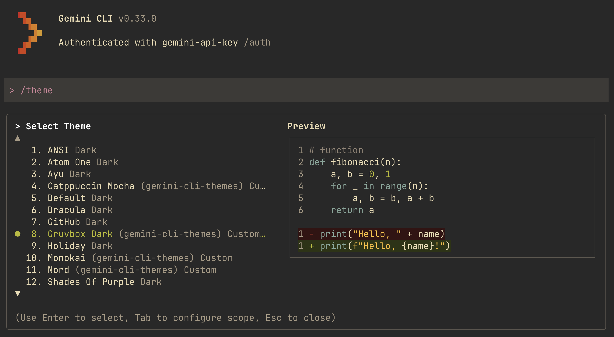

# Gemini CLI Themes Extension :art:

This extension provides a collection of beautiful, high-contrast themes for the Gemini CLI, allowing you to customize your terminal experience.

*Example: Gruvbox Dark*


## Installation

To install this extension, run the following command in your terminal:

```bash
gemini extensions install https://github.com/jackwotherspoon/gemini-cli-themes
```

## Usage

Once the extension is installed you can run `/theme` within Gemini CLI to select one of the custom themes.

## Available Themes

This extension includes the following custom themes, each carefully curated for different aesthetics and readability preferences.

### 1. Gruvbox Dark
A retro groove color scheme with warm, earthy tones.
* **Background:** $\color{#282828}{\blacksquare}$ `#282828` (Primary)
* **Text:** $\color{#ebdbb2}{\blacksquare}$ `#ebdbb2` (Primary), $\color{#a89984}{\blacksquare}$ `#a89984` (Secondary)
* **Accents:** $\color{#d3869b}{\blacksquare}$ `#d3869b` (Accent), $\color{#83a598}{\blacksquare}$ `#83a598` (Link)
* **Status:** $\color{#b8bb26}{\blacksquare}$ `#b8bb26` (Success), $\color{#fabd2f}{\blacksquare}$ `#fabd2f` (Warning), $\color{#fb4934}{\blacksquare}$ `#fb4934` (Error)

### 2. Catppuccin Mocha
A soothing pastel theme with a dark, purplish base.
* **Background:** $\color{#1e1e2e}{\blacksquare}$ `#1e1e2e` (Primary)
* **Text:** $\color{#cdd6f4}{\blacksquare}$ `#cdd6f4` (Primary), $\color{#bac2de}{\blacksquare}$ `#bac2de` (Secondary)
* **Accents:** $\color{#cba6f7}{\blacksquare}$ `#cba6f7` (Accent), $\color{#89b4fa}{\blacksquare}$ `#89b4fa` (Link)
* **Status:** $\color{#a6e3a1}{\blacksquare}$ `#a6e3a1` (Success), $\color{#f9e2af}{\blacksquare}$ `#f9e2af` (Warning), $\color{#f38ba8}{\blacksquare}$ `#f38ba8` (Error)

### 3. Nord
An arctic, north-bluish color palette focused on clarity.
* **Background:** $\color{#2E3440}{\blacksquare}$ `#2E3440` (Primary)
* **Text:** $\color{#D8DEE9}{\blacksquare}$ `#D8DEE9` (Primary), $\color{#4C566A}{\blacksquare}$ `#4C566A` (Secondary)
* **Accents:** $\color{#5E81AC}{\blacksquare}$ `#5E81AC` (Accent), $\color{#88C0D0}{\blacksquare}$ `#88C0D0` (Link)
* **Status:** $\color{#A3BE8C}{\blacksquare}$ `#A3BE8C` (Success), $\color{#EBCB8B}{\blacksquare}$ `#EBCB8B` (Warning), $\color{#BF616A}{\blacksquare}$ `#BF616A` (Error)

### 4. Tokyo Night
A clean, dark theme that celebrates the lights of Downtown Tokyo at night.
* **Background:** $\color{#1a1b26}{\blacksquare}$ `#1a1b26` (Primary)
* **Text:** $\color{#c0caf5}{\blacksquare}$ `#c0caf5` (Primary), $\color{#565f89}{\blacksquare}$ `#565f89` (Secondary)
* **Accents:** $\color{#bb9af7}{\blacksquare}$ `#bb9af7` (Accent), $\color{#7dcfff}{\blacksquare}$ `#7dcfff` (Link)
* **Status:** $\color{#9ece6a}{\blacksquare}$ `#9ece6a` (Success), $\color{#e0af68}{\blacksquare}$ `#e0af68` (Warning), $\color{#f7768e}{\blacksquare}$ `#f7768e` (Error)

### 5. Monokai
A classic, vibrant, and high-contrast dark theme.
* **Background:** $\color{#272822}{\blacksquare}$ `#272822` (Primary)
* **Text:** $\color{#f8f8f2}{\blacksquare}$ `#f8f8f2` (Primary), $\color{#75715e}{\blacksquare}$ `#75715e` (Secondary)
* **Accents:** $\color{#f92672}{\blacksquare}$ `#f92672` (Accent), $\color{#66d9ef}{\blacksquare}$ `#66d9ef` (Link)
* **Status:** $\color{#a6e22e}{\blacksquare}$ `#a6e22e` (Success), $\color{#e6db74}{\blacksquare}$ `#e6db74` (Warning), $\color{#f92672}{\blacksquare}$ `#f92672` (Error)

## Structure

The themes are defined in the `gemini-extension.json` file. Each theme specifies colors for:
- `background`: Primary background and diff background colors (added/removed).
- `text`: Primary and secondary text colors, along with link and accent colors.
- `border`: Default and focused border colors.
- `status`: Colors for success, warning, and error states.
- `ui`: Additional UI elements like comments, symbols, and gradients.
